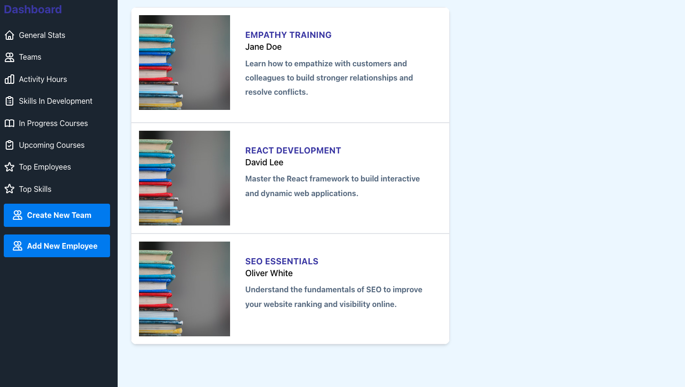

# Dashboard Project

This project is a responsive and interactive dashboard built with React.js, Vite, and Tailwind CSS. It features various sections displaying general stats, team information, activity hours, skills development, and top employees/skills. The project also incorporates beautiful icons and charts for better data visualization.

## Table of Contents
- [Features](#features)
- [Technologies Used](#technologies-used)
- [Installation](#installation)
- [Usage](#usage)
- [Project Structure](#project-structure)
- [Screenshots](#screenshots)
- [Learnings](#learnings)
- [Contributing](#contributing)
- [License](#license)

## Features
- Responsive design with Tailwind CSS
- Dynamic sidebar with sections for different data views
- Integration of Chart.js for displaying activity hours
- Use of Heroicons for intuitive icons
- Easy-to-navigate UI with hamburger menu on smaller screens

## Technologies Used
- **React.js**: A JavaScript library for building user interfaces
- **Vite**: A fast build tool and development server for modern web projects
- **Tailwind CSS**: A utility-first CSS framework for rapid UI development
- **Chart.js**: A simple yet flexible JavaScript charting library
- **Heroicons**: Beautiful, hand-crafted SVG icons

## Installation
To install and run this project locally, follow these steps:

1. **Clone the repository:**
    ```bash
    git clone https://github.com/your-username/dashboard-project.git
    cd dashboard-project
    ```

2. **Install dependencies:**
    ```bash
    npm install
    ```

3. **Start the development server:**
    ```bash
    npm run dev
    ```

4. **Build for production:**
    ```bash
    npm run build
    ```

5. **Preview the production build:**
    ```bash
    npm run serve
    ```

## Usage
Once the development server is running, you can access the dashboard at `http://localhost:3000`. The sidebar allows you to navigate through various sections such as General Stats, Teams, Activity Hours, Skills Development, In Progress Courses, Upcoming Courses, Top Employees, and Top Skills.

## Project Structure
```plaintext
dashboard-project/
├── public/
│   └── index.html
├── src/
│   ├── components/
│   │   ├── Sidebar.jsx
│   │   ├── GeneralStats.jsx
│   │   ├── Teams.jsx
│   │   ├── ActivityHours.jsx
│   │   ├── SkillsDevelopment.jsx
│   │   ├── InProgressCourses.jsx
│   │   ├── UpcomingCourses.jsx
│   │   ├── TopEmployees.jsx
│   │   └── TopSkills.jsx
│   ├── App.jsx
│   ├── index.css
│   └── main.jsx
├── .gitignore
├── package.json
├── README.md
└── tailwind.config.js
## Screenshots




Gainings
Working on this project provided valuable experience in:

Implementing a responsive UI using Tailwind CSS
Managing state and props in React
Integrating Chart.js for dynamic data visualization
Handling conditional rendering for responsive design
Using Vite for efficient development and building

Fork the repository
Create your feature branch (git checkout -b feature/your-feature)
Commit your changes (git commit -m 'Add some feature')
Push to the branch (git push origin feature/your-feature)
Open a pull request
License
This project is licensed under the MIT License.